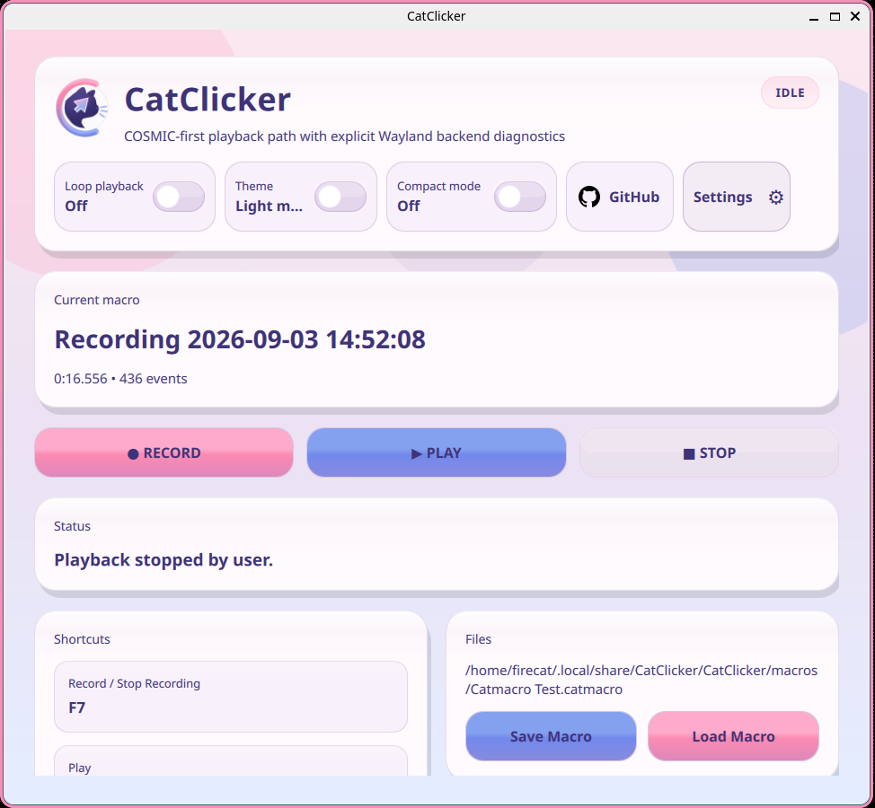
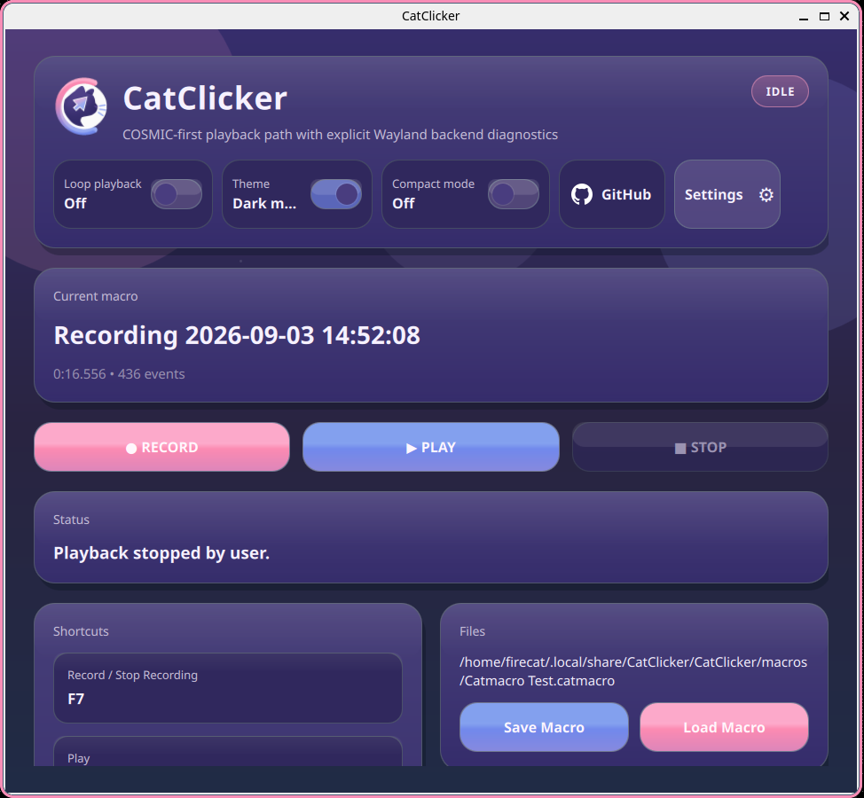
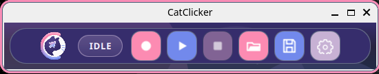
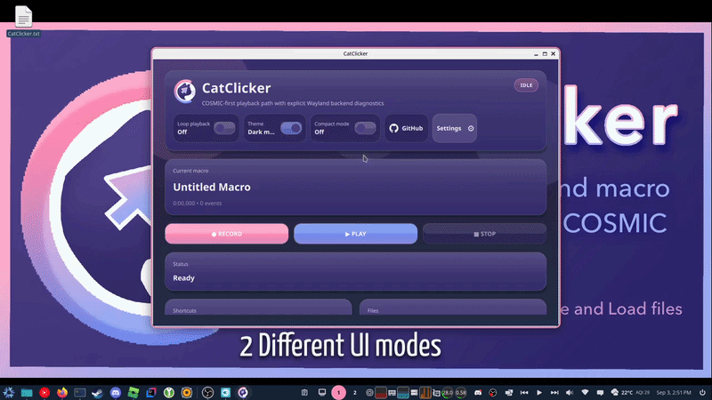

# CatClicker

<p align="center"></p>

CatClicker is a Wayland-native autoclicker and macro recorder built for Pop!_OS and the COSMIC desktop.

## Interface

CatClicker provides Regular and Compact interfaces in both Light and Dark modes.

<table>
  <thead>
    <tr>
      <th></th>
      <th>Light mode</th>
      <th>Dark mode</th>
    </tr>
  </thead>
  <tbody>
    <tr>
      <th>Regular</th>
      <td><strong>Regular — Light</strong><br></td>
      <td><strong>Regular — Dark</strong><br></td>
    </tr>
    <tr>
      <th>Compact</th>
      <td><strong>Compact — Light</strong><br></td>
      <td><strong>Compact — Dark</strong><br></td>
    </tr>
  </tbody>
</table>

CatClicker currently ships with Light and Dark modes. The application palette is centralized in `qml/Theme.qml`, making the visual style straightforward to customize or extend in code. Additional selectable themes are not implemented yet.

## Demo

A full CatClicker workflow demonstration, including macro recording and playback, file interaction, and both interface modes.



## Download

CatClicker v0.1.0 is an early prerelease available as a prebuilt x86-64 bundle for Pop!_OS 24.04 with COSMIC Wayland.

[Download CatClicker v0.1.0 from GitHub Releases](https://github.com/FIRECATinBLACK/CatClicker/releases/tag/v0.1.0), then:

1. Download `CatClicker-v0.1.0-popos24.04-x86_64.tar.gz`.
2. Extract the archive.
3. Open the extracted directory.
4. Run:

   ```bash
   ./bin/CatClicker
   ```

You may also launch the executable graphically after extraction if your file manager permits executing binaries. The bundle is dynamically linked and expects compatible system runtime libraries.

To verify the download with the accompanying `.sha256` file, run:

```bash
sha256sum -c CatClicker-v0.1.0-popos24.04-x86_64.tar.gz.sha256
```

Developers and people investigating other platforms can follow the existing [build-from-source instructions](#build-requirements).

## Status and platform support

CatClicker 0.1.0 is early software. Its primary and currently supported environment is Pop!_OS 24.04 with the COSMIC desktop in a native Wayland session. Other Wayland compositors are not supported yet. Contributions for trustworthy absolute cursor backends on other compositors are welcome. X11 is not a current target.

The current COSMIC implementation has been host tested for keyboard and mouse recording, anchored clicks and scroll, drags, long holds, repeated sessions, global hotkeys, save and load, looping, and optional smooth playback.

## Features

- Passive physical input capture through evdev while recording
- Exact mouse button and scroll anchors from COSMIC cursor metadata
- Keyboard and pointer playback through Linux uinput
- Versioned local `.catmacro` files
- Global record, play, and stop shortcuts
- Looping and selectable playback speed
- Optional cosmetic smoothing between recorded mouse positions
- Regular and Compact interface modes; Compact provides a small toolbar with direct Record, Play, Stop, Open, Save, and Settings controls
- Light and dark CatClicker themes

Regular and Compact modes switch immediately, and the selected mode persists between launches. CatClicker also prevents accidental multiple independent instances; launching it again asks the existing window to activate.

## Important limitations

- COSMIC Wayland is the only supported compositor environment today.
- Input capture and uinput need explicit device permissions.
- A macro replays input into whichever application receives it. Review macros from other people before playback.
- CatClicker never derives absolute coordinates by adding relative mouse deltas. A click or scroll without a trusted absolute position is dropped.

CatClicker does not implement an Always-on-top setting. On current COSMIC, use the window or titlebar menu's **Sticky window** action when you want CatClicker to remain above ordinary windows and visible across workspaces. COSMIC controls this state; CatClicker does not set it programmatically.

## Build requirements

On Pop!_OS 24.04, install the verified build and QML runtime dependencies with:

```bash
./scripts/install-dev-deps.sh
```

The script installs the compiler and CMake tools, Qt 6 development packages and QML runtime modules, PipeWire and input development libraries, Wayland headers, `wayland-scanner`, and wayland-protocols. CatClicker needs Qt 6.4 or newer. Direct COSMIC cursor support uses the vendored ext image capture protocol XML described in [Development](docs/DEVELOPMENT.md).

## Build, install, and run

```bash
cmake -S . -B build -G Ninja
cmake --build build -j4
ctest --test-dir build --output-on-failure
./build/bin/CatClicker
cmake --install build --prefix "$HOME/.local"
```

After installation, launch `CatClicker` from the desktop menu or run `$HOME/.local/bin/CatClicker`.

## Input permissions

Do not run the GUI as root and do not make input devices globally writable. Run `./scripts/setup-input-permissions.sh` once, or let CatClicker request its installed copy through Polkit. The helper installs udev rules using `uaccess` for `/dev/uinput` and eligible physical input devices. CatClicker never collects a password and does not prompt when access is already correct.

## Record and play

1. Choose Record or use the record shortcut.
2. Perform the actions to capture, then choose Stop.
3. Save the macro if wanted, then choose Play.
4. Stop playback at any time with the stop shortcut.

Mouse actions whose positions cannot be trusted are omitted. Smooth playback adds cosmetic intermediate positions only. It does not change the macro file, and saved click and scroll anchors remain exact.

## Privacy and safety

CatClicker has no telemetry, analytics, update checker, or network client. Recordings remain local unless you share them. The GitHub button only asks your desktop browser to open the fixed project URL after you click it. See [Privacy](docs/PRIVACY.md) and [Macro format](docs/MACRO_FORMAT.md).

Macro text is parsed as data and is never passed to a shell. Replayed keyboard input can still be interpreted by the target application. Text deliberately replayed into a terminal may be executed by that terminal. CatClicker itself does not execute macro text.

## Project documentation

- [Architecture](docs/ARCHITECTURE.md)
- [COSMIC Wayland cursor design](docs/COSMIC_WAYLAND.md)
- [Development](docs/DEVELOPMENT.md)
- [Debugging](docs/DEBUGGING.md)
- [Performance](docs/PERFORMANCE.md)
- [Contributing](CONTRIBUTING.md)
- [Security policy](SECURITY.md)

Support for additional compositor backends, tests, documentation fixes, and focused code improvements is welcome.

## AI disclosure

CatClicker has been developed with assistance from AI coding tools for researching and debugging. Changes are reviewed, tested, and validated on the target environment before they are accepted.
Any assets have been human drawn with love.

## License

CatClicker source code is licensed under GPL-3.0-or-later. See [LICENSE](LICENSE).
